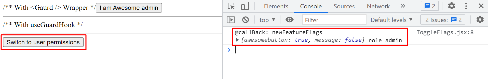

# React FeatureFlag Hooks and wrapper

### Hooks 
* useFlagHook
* useGaurdHook
* usage useGaurdHook('awesome-button') | return boolean
### update feature flags on the fly
* The useFlagHook give updateContext method 
### callback after each update
* the updateContext accepts callback as second parameter
* this callback gets newFeatureFlags and new role as parameters
### Wrapper component <Gaurd> with support of fallback component
* Renders children only if flag prop is true for current role
* If fallback prop is provided and flag prop is false for current role, renders fallback
### App.js
```js
import { FeatureFlagProvider } from 'featureflag-hooks';
import Home from './Pages/Home';

const flagList = {
  admin:{
      awesomebutton:true,
      message:false
  },
  user:{
      awesomebutton:false,
      message:true
  }
}

function App() {
  return (
    <FeatureFlagProvider initialRoleName='admin' featureFlagsDictionary={flagList} >
      <Home/>
    </FeatureFlagProvider>
  );
}

export default App;
```
### Home.js
* using the Gaurd wrapper
```JS
import React from 'react'
import { Gaurd } from 'featureflag-hooks'
import AwesomeButton from './AwesomeButton'
import SecretMessage from './SecretMessage'
import ToggleFlags from './ToggleFlags'
const fallback = <h1>Opps you don't have the permissions</h1>
const Home = () => {
    return (
        <div>
             /** With &lt;Gaurd /&gt; Wrapper */
            <Gaurd fallback={fallback} flag='awesomebutton'>
                <AwesomeButton/>
            </Gaurd>
            <hr/>
            /** With useGuardHook */
            <SecretMessage/>
            <hr/>
            <ToggleFlags/>
        </div>
    )
}

export default Home
```
### SecretMessage.jsx
* using the useGaurdHook
```JS
import React from 'react'
import { useGuardHook } from 'featureflag-hooks'

const SecretMessage = () => {
    const hasPermission = useGuardHook('message')
    return (
        hasPermission ?<h1>Secret message for user</h1>:null
    )
}

export default SecretMessage
```
### ToggleFlags.jsx
* using the updateContext method via useFlagHook
```js
import React from 'react'
import { useFlagHook } from 'featureflag-hooks'

const ToggleFlags = () => {
    const {  role, updateContext } = useFlagHook()
    const nextRole = role==='admin'?'user':'admin'
    const callBack = (newFeatureFlags,role)=>{
        console.log('@callBack: newFeatureFlags',newFeatureFlags,'role',role)
    }
    const handleToggle =()=> {
        updateContext(nextRole,callBack)
    }
    return (
        <button onClick={handleToggle}>Switch to {nextRole} permissions</button>
    )
}

export default ToggleFlags
```
### Output
